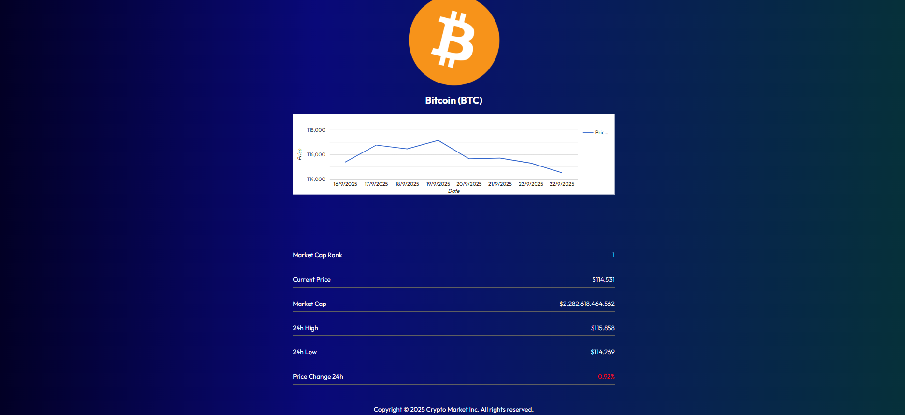
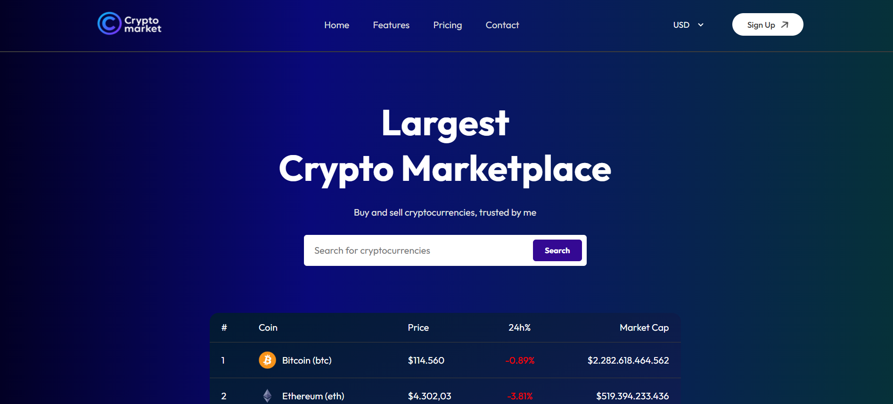

# Crypto Market - React Web

Crypto Market là một ứng dụng web được xây dựng bằng React giúp bạn tra cứu, theo dõi giá và thông tin các loại tiền điện tử phổ biến. Ứng dụng sử dụng API từ CoinGecko để cập nhật dữ liệu thị trường theo thời gian thực.

## Ảnh giao diện

### Trang chủ



### Trang chi tiết coin



## Tính năng nổi bật

- Xem danh sách các đồng coin phổ biến với giá theo nhiều loại tiền tệ (USD, EUR, VND).
- Tra cứu chi tiết từng đồng coin: biểu đồ giá, thông tin cơ bản, lịch sử giá.
- Chuyển đổi đơn vị tiền tệ dễ dàng ngay trên thanh điều hướng.
- Giao diện hiện đại, responsive, dễ sử dụng.
- Tìm kiếm coin nhanh chóng.
- Đăng ký tài khoản (demo UI).

## Công nghệ sử dụng

- ReactJS
- React Router DOM
- React Context API
- react-google-charts
- CSS modules
- CoinGecko API

## Cài đặt & chạy dự án

1. **Clone repository:**
   ```bash
   git clone https://github.com/yourusername/crypto-market-react.git
   cd crypto-market-react
   ```

2. **Cài đặt dependencies:**
   ```bash
   npm install
   ```

3. **Chạy ứng dụng:**
   ```bash
   npm run dev
   ```
   Truy cập [http://localhost:5173](http://localhost:5173) trên trình duyệt.

## Cấu trúc thư mục

```
src/
  ├── components/
  │     ├── navbar/
  │     ├── LineChart/
  │     └── Footer/
  ├── context/
  ├── pages/
  │     ├── Home/
  │     └── Coin/
  ├── assets/
  ├── App.jsx
  ├── index.css
```

## API sử dụng

- [CoinGecko API](https://www.coingecko.com/en/api/documentation)

## Đóng góp

Mọi đóng góp, ý kiến hoặc báo lỗi vui lòng tạo issue hoặc pull request trên GitHub.

---
